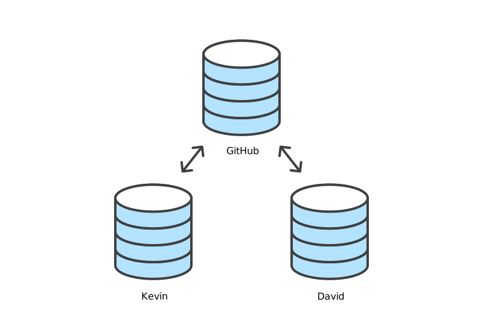

# svg

Repository of SVG files shared across projects.

## Git

[git-branch-conflict-push.svg](git-branch-conflict-push.svg) - Conflicting clones of a Git repository, highlighted.

Conflicting clones of a Git repository.

Collaborating with clones of a Git repository.

Deleting merged branches.

## SSH

The concept of SSH key pair.
