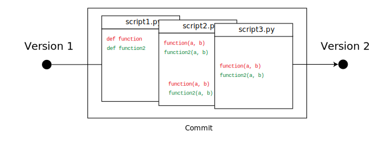
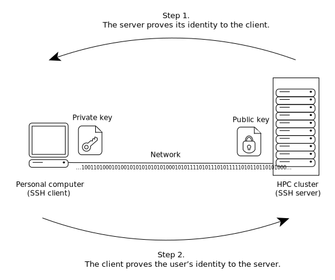

# svg

Repository of SVG files shared across projects.

## Git

Conflicting clones of a repository, highlighted.

Conflicting clones of a repository.

Deleting merged branches.

Merging branches.

Clones of a repository with branches without conflict.

Collaborating with clones of a repository.

Committing multiple files.

## SSH

The concept of SSH key pair.
